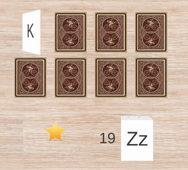

# Description
A simple matching game built to help my grandma learn the different letters of the Engligh alphabet and their corresponding sounds. 
Built using React.js with TypeScript.

# Motivation
I could not find any games teaching the alphabet aimed at adults trying to learn English as a second language. Most language learning games assume pre-requisite knowledge of the alphabet and games that do teach the alphabet are primarily aimed at kids.

# Demo

# TODO:
## Fixes:
- [x] Do not remove cards from the DOM, instead disable so that remaining cards do not slide
   - Use Enum to describe card state
- [x] Fix the stupid offset caused by flip animation
- [x] Recreate L sound, because it is weird
- [ ] Fix bug where quick flipping causes no audio on the second flip
- [ ] Fix bug where if the letter is in the same place it doesn't re-render (Firefox only...)
- [ ] Refactor so I'm not using so many different CSS methods
- [ ] Fix screen-size issue with cards
## Features:
- [x] Add sound effects for successfully matching and failing to match 
- [x] Add multiple rounds
- [x] Randomize the cards
- [ ] Add fade-out animation for succesful match (Use pose?)
- [x] Use a warmer color pallete to reduce eye strain
- [ ] Add menu for levels settings
- [ ] Add button to reduce audio playback speed
- [x] Add score indicator

# Attributions
## Icons
- (Slow Snail Audio Playback) slow by Davide Dosse Dossena from the Noun Project
- (Letter sounds) AllAboutLearning
